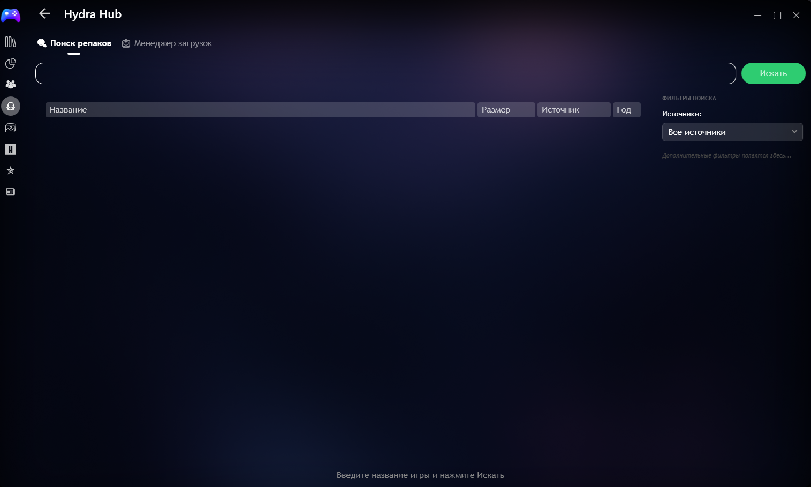
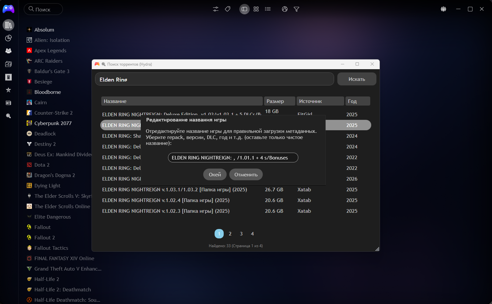
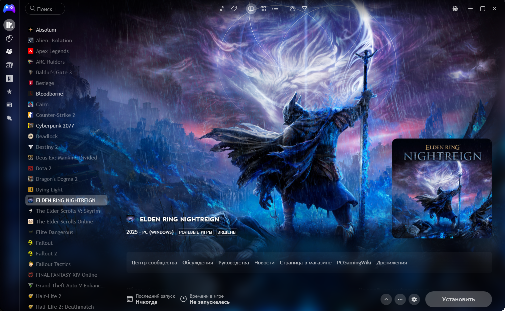
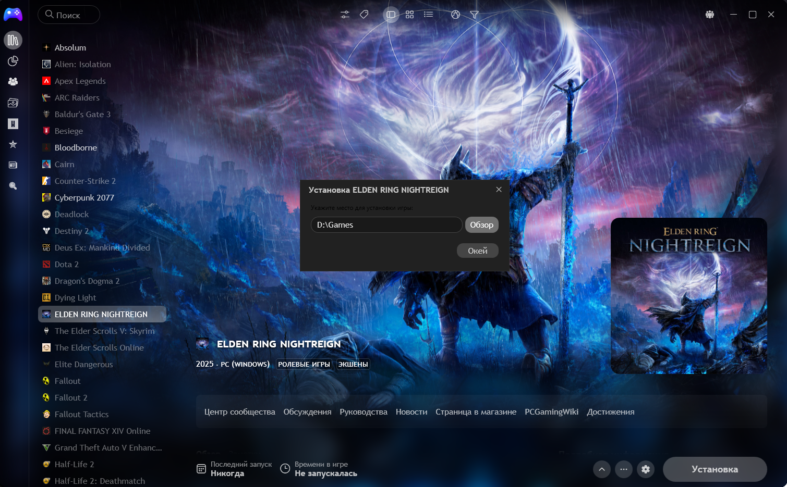
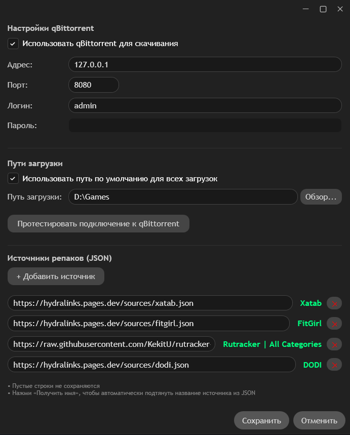

# HydraTorrent для Playnite

**Самый удобный способ скачивать репаков прямо внутри Playnite**  
*(как Hydra Launcher, только лучше и роднее)*

---

### 🎯 Что это такое?

**HydraTorrent** — это мощный плагин для Playnite, который превращает твой любимый лаунчер в полноценный торрент-менеджер репаков.

Больше не нужно открывать браузер, копировать magnet-ссылки и искать где что лежит.  
Всё в одном месте: поиск → добавление → установка через qBittorrent.

---

### ✨ Уже реализовано

- 🔍 **Умный поиск** по всем популярным репакерам (FitGirl, Xatab и другие через Hydra JSON)
- ✏️ **Ручное редактирование названия** перед добавлением (убирает "Repack", "v1.2.3", "MULTi" и т.д.)
- 📥 **Кнопка «Установить через Hydra Torrent»** прямо в карточке игры
- 🌐 **Полная интеграция с qBittorrent** (WebAPI) — торрент добавляется автоматически
- 📁 **Выбор пути установки** (с сохранением дефолтного пути в настройках)
- ⚙️ **Удобные настройки** плагина + кнопка «Протестировать подключение»
- 💾 **Надёжное хранение** magnet-ссылок и данных каждой игры

### 🚀 Планируется в ближайшее время

- 📊 **Красивый прогресс-бар** прямо в карточке игры («Идёт загрузка 47%»)
- 📈 **Полноценное окно прогресса** (скорость, ETA, пауза/возобновление, открытие папки)
- 🔄 **Автоматический мониторинг** всех торрентов Hydra
- 📦 **Автоустановщик** репаков (распаковка после скачивания)
- 🌍 Поддержка большего количества источников

---

### Скриншоты

<!-- === СКРИНШОТЫ (замени ссылки после загрузки файлов в папку screenshots) === -->

*Удобный поиск прямо над библиотекой*

*Ручное редактирование названия перед добавлением*

*Кнопка «Установить через Hydra Torrent»*

*Удобный выбор папки для установки*

*Настройки qBittorrent + тест подключения*

---

### Установка

1. Скачай последний релиз (`HydraTorrent.pext`) из раздела **[Releases](https://github.com/ТВОЙ_НИК/Playnite-HydraTorrent/releases)**
2. В Playnite зайди в **Меню → Аддоны → Установить из файла...**
3. Выбери скачанный `.pext` файл
4. Перезапусти Playnite

---

### Настройка

1. Открой **Настройки → Плагины → HydraTorrent → Настроить**
2. Включи qBittorrent и укажи:
   - Адрес: `127.0.0.1`
   - Порт: `8080` (по умолчанию)
   - Логин и пароль от WebUI qBittorrent
3. Нажми **«Протестировать подключение»** — должно быть ✅
4. (Опционально) Укажи путь по умолчанию для установки игр

---

### Как пользоваться

1. Нажми на иконку **🔍 Поиск торрентов (Hydra)** в боковой панели
2. Введи название игры → найди нужный репак
3. Дважды кликни → отредактируй название → добавь в библиотеку
4. Зайди в карточку игры → нажми **«Установить»**
5. Выбери путь (или используй дефолтный) → торрент сразу улетит в qBittorrent!

---

### Будущее проекта

Мы активно развиваем плагин.  
Следующая большая фича — **прогресс загрузки прямо в карточке игры**.  
Хочешь помочь или предложить идею? Пиши в Issues или Discussions!

---

**Лицензия**: MIT  
**Автор**: BCDezgun + Grok (с любовью ❤️)

### English version
# HydraTorrent for Playnite

**The most convenient way to download repacks directly within Playnite** *(Like Hydra Launcher, but better and more native)*

---

### 🎯 What is it?

**HydraTorrent** is a powerful plugin for Playnite that transforms your favorite launcher into a full-fledged repack torrent manager.

No more opening browsers, copying magnet links, or searching for files.  
Everything in one place: Search → Add → Install via qBittorrent.

---

### ✨ Current Features

- 🔍 **Smart Search** across all popular repackers (FitGirl, Xatab, and others via Hydra JSON)
- ✏️ **Manual Title Editing** before adding (easily remove "Repack", "v1.2.3", "MULTi", etc.)
- 📥 **"Install via Hydra Torrent" Button** directly on the game card
- 🌐 **Full qBittorrent Integration** (WebAPI) — torrents are added automatically
- 📁 **Installation Path Selection** (with the option to save a default path in settings)
- ⚙️ **User-friendly Settings** + "Test Connection" button
- 💾 **Reliable Storage** for magnet links and metadata for each game

### 🚀 Coming Soon

- 📊 **Sleek Progress Bar** directly on the game card ("Downloading 47%")
- 📈 **Full Progress Window** (speed, ETA, pause/resume, open folder)
- 🔄 **Automatic Monitoring** of all Hydra torrents
- 📦 **Repack Auto-Installer** (automatic extraction after download)
- 🌍 Support for more sources

---

### Screenshots

*Convenient search directly above your library*

*Manual title editing before adding to library*

*"Install via Hydra Torrent" button*

*Easy folder selection for installation*

*qBittorrent settings + connection test*

---

### Installation

1. Download the latest release (`HydraTorrent.pext`) from the **[Releases](https://github.com/YOUR_USERNAME/Playnite-HydraTorrent/releases)** section.
2. In Playnite, go to **Menu → Add-ons → Install from file...**
3. Select the downloaded `.pext` file.
4. Restart Playnite.

---

### Configuration

1. Open **Settings → Plugins → HydraTorrent → Configure**.
2. Enable qBittorrent and provide:
   - Address: `127.0.0.1`
   - Port: `8080` (default)
   - Login and Password for the qBittorrent WebUI.
3. Click **"Test Connection"** — it should show ✅.
4. (Optional) Set a default installation path for your games.

---

### How to Use

1. Click the **🔍 Torrent Search (Hydra)** icon in the sidebar.
2. Type the game title → find the desired repack.
3. Double-click → edit the title if needed → add to library.
4. Go to the game card → click **"Install"**.
5. Choose a path (or use the default) → the torrent will be sent to qBittorrent immediately!

---

### Future of the Project

We are actively developing this plugin.  
The next major feature will be **download progress display directly on the game card**.  
Want to help or suggest an idea? Feel free to post in Issues or Discussions!

---

**License**: MIT  
**Authors**: BCDezgun + Grok (with love ❤️)