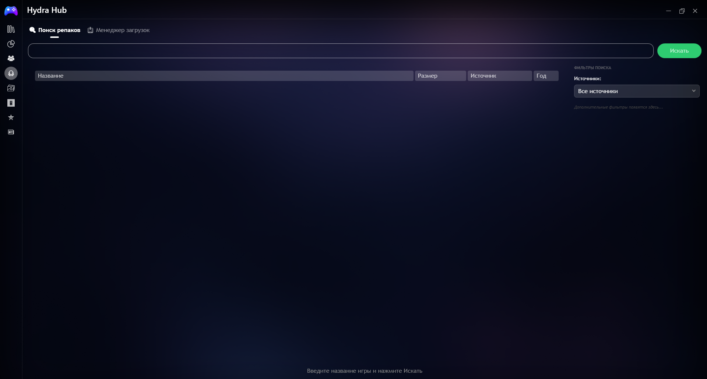
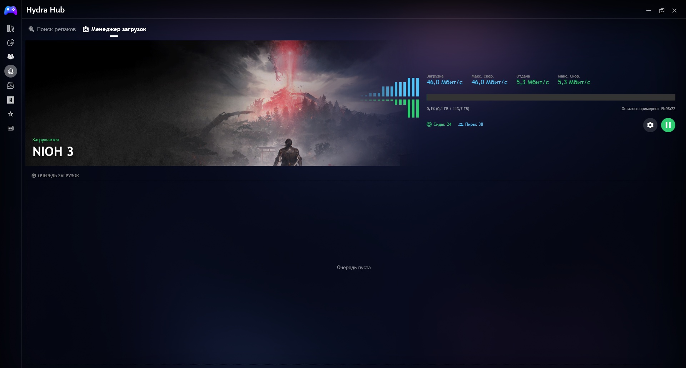
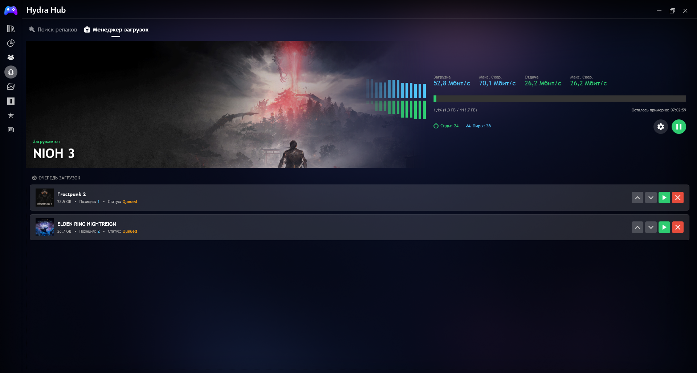

# 🐙 HydraTorrent

**Download Manager Plugin for Playnite**

---

[🇬 English](#-english) • [🇷🇺 Русский](#-русский)

---

# 🇬🇧 English

## ⚠️ Disclaimer

> **This plugin is a technical tool for managing torrent downloads within Playnite.**
> 
> It does not host, distribute, or provide any copyrighted content. Users are responsible for:
> - Ensuring they have legal rights to download any content
> - Complying with their local copyright laws
> - Using this plugin only with legally obtained torrents
> 
> The developer is not responsible for any misuse of this plugin.

---

## 📖 Description

**HydraTorrent** is a library plugin for [Playnite](https://playnite.link/) that integrates torrent download management directly into your game library. It works with qBittorrent to provide a seamless download experience with queue management, priority settings, and real-time status tracking.

---

## ✨ Features

### 🔍 Search & Library
- Search for games from configurable sources
- Filter results by source
- Search history with quick access
- Automatic game import to Playnite library

### 📥 Download Management
- **Queue System** — Add multiple games to download queue
- **Priority Management** — Move games up/down in queue
- **Force Start** — Start any queued game immediately
- **Auto-Continue** — Next game starts automatically when current completes
- **Pause/Resume** — Full control over active downloads

### 📊 Real-Time Monitoring
- Download speed graph
- Progress bar with ETA
- Current & maximum speed display
- Background images from Playnite library

### 🛠 Integration
- qBittorrent API integration
- Custom download paths
- Torrent data persistence
- State recovery after restart

---

## 📋 Requirements

| Requirement | Version |
|-------------|---------|
| Playnite | 10.x or higher |
| .NET Framework | 6.0 or higher |
| qBittorrent | 4.4.x or higher |
| Operating System | Windows 10/11 |

---

## 🚀 Installation

### Method 1: Automatic (not available yet)
1. Open Playnite
2. Go to **Add-ons** → **Plugins**
3. Find **HydraTorrent** in the list
4. Click **Install**

### Method 2: Manual
1. Download the latest release from [Releases](https://github.com/BCDezgun/Playnite-HydraTorrent/releases)
2. Extract files to: `%AppData%\Playnite\Extensions\HydraTorrent`
3. Restart Playnite
4. Configure qBittorrent connection in plugin settings

---

## ⚙️ Configuration

### qBittorrent Settings
1. Open qBittorrent
2. Go to **Tools** → **Options** → **Web UI**
3. Enable **Web User Interface**
4. Note the **IP Address** and **Port** (default: `localhost:8080`)
5. Set username and password
6. Save settings

### Plugin Settings
1. Open Playnite
2. Go to **Settings** → **Plugins** → **HydraTorrent**
3. Enter qBittorrent connection details
4. Configure default download path (optional)
5. Save settings

---

## 🎮 Usage

### Adding Games to Queue
1. Open **Hydra Hub** from sidebar
2. Search for a game
3. Double-click to add to library
4. Click **Install** to start download or add to queue

### Managing Queue
| Button | Action |
|--------|--------|
| ⬆️ | Move game up in queue |
| ⬇️ | Move game down in queue |
| ▶️ | Force start this game |
| ❌ | Remove from queue |

### During Download
- View real-time speed graph
- Pause/Resume with one click
- Delete torrent and files via settings menu
- Next game auto-starts when completed

---

## 📸 Screenshots

| Search | Download Manager | Queue |
|--------|-----------------|-------|
|  |  |  |

---

## 🐛 Troubleshooting

| Problem | Solution |
|---------|----------|
| Cannot connect to qBittorrent | Check Web UI is enabled and credentials are correct |
| Downloads don't start | Verify download path exists and has write permissions |
| Queue doesn't auto-continue | Ensure qBittorrent connection is stable |
| UI doesn't update | Restart Playnite or reload plugin |

---

## 📄 License

This project is licensed under the MIT License — see the [LICENSE](LICENSE) file for details.

---

## 🤝 Contributing

Contributions are welcome! Please feel free to submit a Pull Request.

1. Fork the repository
2. Create your feature branch (`git checkout -b feature/AmazingFeature`)
3. Commit your changes (`git commit -m 'Add some AmazingFeature'`)
4. Push to the branch (`git push origin feature/AmazingFeature`)
5. Open a Pull Request

---

## 📬 Contact

- **Issues:** [GitHub Issues](https://github.com/BCDezgun/Playnite-HydraTorrent/issues)
- **Discussions:** [GitHub Discussions](https://github.com/BCDezgun/Playnite-HydraTorrent/discussions)

---

# 🇷 Русский

## ⚠️ Отказ от ответственности

> **Этот плагин является техническим инструментом для управления загрузками через торренты в Playnite.**
> 
> Он не хранит, не распространяет и не предоставляет защищённый авторским правом контент. Пользователи несут ответственность за:
> - Соблюдение авторских прав при загрузке контента
> - Соответствие локальному законодательству
> - Использование только с легально полученными торрентами
> 
> Разработчик не несёт ответственности за неправильное использование плагина.

---

## 📖 Описание

**HydraTorrent** — это библиотечный плагин для [Playnite](https://playnite.link/), который интегрирует управление торрент-загрузками прямо в вашу игровую библиотеку. Плагин работает с qBittorrent и предоставляет удобный интерфейс для управления очередью загрузок, приоритетами и отслеживанием статуса в реальном времени.

---

## ✨ Возможности

### 🔍 Поиск и библиотека
- Поиск игр из настраиваемых источников
- Фильтрация результатов по источнику
- История поиска с быстрым доступом
- Автоматический импорт игр в библиотеку Playnite

### 📥 Управление загрузками
- **Система очереди** — Добавление нескольких игр в очередь загрузок
- **Управление приоритетами** — Перемещение игр вверх/вниз по очереди
- **Принудительный запуск** — Немедленный запуск любой игры из очереди
- **Авто-продолжение** — Следующая игра запускается автоматически после завершения текущей
- **Пауза/Возобновление** — Полный контроль над активными загрузками

### 📊 Мониторинг в реальном времени
- График скорости загрузки
- Прогресс-бар с оставшимся временем
- Отображение текущей и максимальной скорости
- Фоновые изображения из библиотеки Playnite

### 🛠 Интеграция
- Интеграция с qBittorrent API
- Настраиваемые пути загрузки
- Сохранение данных торрентов
- Восстановление состояния после перезапуска

---

## 📋 Требования

| Требование | Версия |
|------------|--------|
| Playnite | 10.x или выше |
| .NET Framework | 6.0 или выше |
| qBittorrent | 4.4.x или выше |
| Операционная система | Windows 10/11 |

---

## 🚀 Установка

### Способ 1: Автоматическая (пока недоступно)
1. Откройте Playnite
2. Перейдите в **Дополнения** → **Плагины**
3. Найдите **HydraTorrent** в списке
4. Нажмите **Установить**

### Способ 2: Ручная
1. Скачайте последнюю версию из [Releases](https://github.com/BCDezgun/Playnite-HydraTorrent/releases)
2. Распакуйте файлы в: `%AppData%\Playnite\Extensions\HydraTorrent`
3. Перезапустите Playnite
4. Настройте подключение к qBittorrent в настройках плагина

---

## ⚙️ Настройка

### Настройки qBittorrent
1. Откройте qBittorrent
2. Перейдите в **Инструменты** → **Настройки** → **Веб-интерфейс**
3. Включите **Веб-интерфейс**
4. Запомните **IP-адрес** и **Порт** (по умолчанию: `localhost:8080`)
5. Установите логин и пароль
6. Сохраните настройки

### Настройки плагина
1. Откройте Playnite
2. Перейдите в **Настройки** → **Плагины** → **HydraTorrent**
3. Введите данные подключения к qBittorrent
4. Настройте путь загрузки по умолчанию (опционально)
5. Сохраните настройки

---

## 🎮 Использование

### Добавление игр в очередь
1. Откройте **Hydra Hub** из боковой панели
2. Найдите игру
3. Дважды кликните для добавления в библиотеку
4. Нажмите **Установить** для начала загрузки или добавления в очередь

### Управление очередью
| Кнопка | Действие |
|--------|----------|
| ⬆️ | Поднять игру выше в очереди |
| ⬇️ | Опустить игру ниже в очереди |
| ▶️ | Принудительно запустить эту игру |
| ❌ | Удалить из очереди |

### Во время загрузки
- Просмотр графика скорости в реальном времени
- Пауза/Возобновление одним кликом
- Удаление торрента и файлов через меню настроек
- Следующая игра запускается автоматически после завершения

---

## 📸 Скриншоты

| Поиск | Менеджер загрузок | Очередь |
|-------|-------------------|---------|
|  |  |  |

---

## 🐛 Решение проблем

| Проблема | Решение |
|----------|---------|
| Не удаётся подключиться к qBittorrent | Проверьте что Веб-интерфейс включен и учётные данные верны |
| Загрузки не начинаются | Убедитесь что путь загрузки существует и есть права на запись |
| Очередь не авто-продолжается | Убедитесь что подключение к qBittorrent стабильно |
| UI не обновляется | Перезапустите Playnite или перезагрузите плагин |

---

## 📄 Лицензия

Этот проект лицензирован под лицензией MIT — подробности в файле [LICENSE](LICENSE).

---

## 🤝 Участие в разработке

Вклад приветствуется! Не стесняйтесь отправить Pull Request.

1. Форкните репозиторий
2. Создайте ветку для функции (`git checkout -b feature/AmazingFeature`)
3. Закоммитьте изменения (`git commit -m 'Add some AmazingFeature'`)
4. Отправьте в ветку (`git push origin feature/AmazingFeature`)
5. Откройте Pull Request

---

## 📬 Контакты

- **Баги:** [GitHub Issues](https://github.com/BCDezgun/Playnite-HydraTorrent/issues)
- **Обсуждения:** [GitHub Discussions](https://github.com/BCDezgun/Playnite-HydraTorrent/discussions)

---

**Made with ❤️ for Playnite Community**

⭐ Star this repo if you find it useful!

