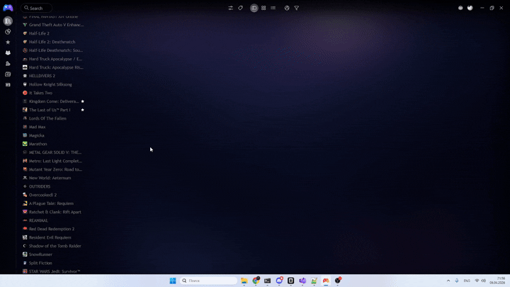
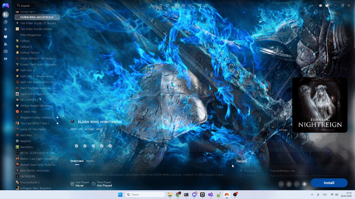

# 🐉 HydraTorrent

**Download Manager Plugin for Playnite**

---

[🇬🇧 English](#-english) • [🇷🇺 Русский](#-русский)

---

# 🇬🇧 English

## ⚠️ Disclaimer

> **This plugin is a technical tool for managing torrent downloads within Playnite.**
> 
> It does not host, distribute, or provide any copyrighted content. Users are responsible for:
> - Ensuring they have legal rights to download any content
> - Complying with their local copyright laws
> - Using this plugin only with legally obtained torrents
> 
> The developer is not responsible for any misuse of this plugin.

---

## 📖 Description

**HydraTorrent** is a library plugin for [Playnite](https://playnite.link/) that integrates torrent download management directly into your game library. It works with qBittorrent to provide a seamless download experience with intelligent automation, queue management, and real-time status tracking.

---

## ✨ Key Features

### 🤖 Smart Automation
- **Auto Game Setup** — Detects game type (Repack/Portable) and configures Play/Install actions automatically
- **IGDB Autocomplete** — Real-time game name suggestions as you type
- **Steam Metadata** — Auto-downloads game info, artwork, and covers (25+ languages)
- **SteamGridDB Integration** — High-quality covers, backgrounds, and icons

### 📥 Download Management
- **Queue System** — Add multiple games with priority control
- **Force Start** — Prioritize any queued download instantly
- **Auto-Continue** — Next game starts automatically when current completes
- **Pause/Resume** — Full control with instant UI feedback
- **Speed Graphs** — Real-time download/upload visualization

### 📊 Tracking & Stats
- **Statistics Dashboard** — Track downloads, size, time, speed, ratio, and top games
- **Completed Tab** — History with completion date, size, ratio, and duration
- **Discord Rich Presence** — Show what you're downloading with game artwork
- **Seeding Settings** — Configure ratio thresholds and auto-removal

### 🎨 Visual Polish
- **Game Preview Banner** — See game info before searching torrents
- **2:3 Aspect Ratio Covers** — Native vertical covers (no cropping!)
- **Animated UI** — Search button effects, fade-in transitions
- **Background Images** — Immersive game artwork with gradient mask

---

## 📸 Screenshots

### Search & Add to Library

*IGDB autocomplete, game preview, Steam metadata auto-download*

### Download & Discord Integration

*Progress overlay, speed graphs, Discord Rich Presence*

---

## 📋 Requirements

| Requirement | Version |
|-------------|---------|
| Playnite | 10.x or higher |
| .NET Framework | 6.0 or higher |
| qBittorrent | 4.4.x or higher |
| Operating System | Windows 10/11 |

---

## 🚀 Installation

1. Download the latest release from [Releases](https://github.com/BCDezgun/Playnite-HydraTorrent/releases)
2. Double-click the `.pext` file to install
3. Restart Playnite
4. Configure qBittorrent connection in plugin settings

---

## ⚙️ Configuration

### qBittorrent Settings
1. Open qBittorrent
2. Go to **Tools** → **Options** → **Web UI**
3. Enable **Web User Interface**
4. Note the **IP Address** and **Port** (default: `localhost:8080`)
5. Set username and password
6. Save settings

### Plugin Settings
1. Open Playnite
2. Go to **Settings** → **Plugins** → **HydraTorrent**
3. Enter qBittorrent connection details
4. (Optional) Add SteamGridDB API key for artwork
5. (Optional) Configure seeding settings
6. Save settings

---

## 🎮 Usage

### Adding Games
1. Open **Hydra Hub** from sidebar (🐉 icon)
2. Type game name (autocomplete suggestions appear)
3. Click search or select from suggestions
4. Double-click result to add to library
5. Click **Install** to start download

### Managing Queue
- **⬆️⬇️** — Move game up/down in queue
- **▶️** — Force start this game
- **⏸️** — Pause/Resume download
- **❌** — Remove from queue

### After Download
- **Repack** — Install action created automatically
- **Portable** — Play action created, game ready to launch
- **Statistics** — View in Statistics tab
- **Completed** — Check Completed tab for history

---

## 📌 Theme Integration (Optional)

**For FusionX theme users:** To enable download progress overlay in game details, add the integration file to:
%AppData%\Playnite\Themes\Desktop\FusionX\Views\

Download: [DetailsViewGameOverview.xaml](https://github.com/BCDezgun/Playnite-HydraTorrent/releases)

---

## 🐛 Troubleshooting

| Problem | Solution |
|---------|----------|
| Cannot connect to qBittorrent | Check Web UI is enabled and credentials are correct |
| Downloads don't start | Verify download path exists and has write permissions |
| No autocomplete suggestions | Check internet connection (IGDB API required) |
| No game covers | Add SteamGridDB API key in settings |
| UI doesn't update | Restart Playnite or reload plugin |

---

## 📄 License

This project is licensed under the MIT License — see the [LICENSE](LICENSE) file for details.

---

## 🤝 Contributing

Contributions are welcome! Please feel free to submit a Pull Request.

1. Fork the repository
2. Create your feature branch (`git checkout -b feature/AmazingFeature`)
3. Commit your changes (`git commit -m 'Add some AmazingFeature'`)
4. Push to the branch (`git push origin feature/AmazingFeature`)
5. Open a Pull Request

---

## 📬 Contact

- **Issues:** [GitHub Issues](https://github.com/BCDezgun/Playnite-HydraTorrent/issues)
- **Discussions:** [GitHub Discussions](https://github.com/BCDezgun/Playnite-HydraTorrent/discussions)

---

# 🇷🇺 Русский

## ⚠️ Отказ от ответственности

> **Этот плагин является техническим инструментом для управления загрузками через торренты в Playnite.**
> 
> Он не хранит, не распространяет и не предоставляет защищённый авторским правом контент. Пользователи несут ответственность за:
> - Соблюдение авторских прав при загрузке контента
> - Соответствие локальному законодательству
> - Использование только с легально полученными торрентами
> 
> Разработчик не несёт ответственности за неправильное использование плагина.

---

## 📖 Описание

**HydraTorrent** — это библиотечный плагин для [Playnite](https://playnite.link/), который интегрирует управление торрент-загрузками прямо в вашу игровую библиотеку. Плагин работает с qBittorrent и предоставляет удобный интерфейс с интеллектуальной автоматизацией, управлением очередью и отслеживанием статуса в реальном времени.

---

## ✨ Основные возможности

### 🤖 Умная автоматизация
- **Автонастройка игр** — Определяет тип игры (Repack/Portable) и создаёт действия автоматически
- **Автодополнение IGDB** — Подсказки названий игр в реальном времени
- **Метаданные Steam** — Автозагрузка информации, обложек и артов (25+ языков)
- **Интеграция SteamGridDB** — Высококачественные обложки, фоны и иконки

### 📥 Управление загрузками
- **Система очереди** — Добавление нескольких игр с управлением приоритетами
- **Принудительный запуск** — Мгновенный запуск любой игры из очереди
- **Авто-продолжение** — Следующая игра запускается автоматически
- **Пауза/Возобновление** — Полный контроль с мгновенной обратной связью
- **Графики скорости** — Визуализация загрузки/отдачи в реальном времени

### 📊 Отслеживание и статистика
- **Панель статистики** — Отслеживание загрузок, размера, времени, скорости, рейтинга
- **Вкладка завершённых** — История с датой, размером, рейтингом и длительностью
- **Discord Rich Presence** — Показывайте что скачиваете с обложкой игры
- **Настройки сидирования** — Настройка порогов рейтинга и автоудаления

### 🎨 Визуальная полировка
- **Баннер превью игры** — Информация об игре перед поиском торрентов
- **Обложки 2:3** — Нативные вертикальные обложки (без обрезки!)
- **Анимированный UI** — Эффекты кнопки поиска, плавные переходы
- **Фоновые изображения** — Иммерсивные арты игр с градиентной маской

---

## 📸 Скриншоты

### Поиск и добавление в библиотеку

*Автодополнение IGDB, превью игры, автозагрузка метаданных Steam*

### Загрузка и интеграция с Discord

*Оверлей прогресса, графики скорости, Discord Rich Presence*

---

## 📋 Требования

| Требование | Версия |
|------------|--------|
| Playnite | 10.x или выше |
| .NET Framework | 6.0 или выше |
| qBittorrent | 4.4.x или выше |
| Операционная система | Windows 10/11 |

---

## 🚀 Установка

1. Скачайте последнюю версию из [Releases](https://github.com/BCDezgun/Playnite-HydraTorrent/releases)
2. Дважды кликните на файл `.pext` для установки
3. Перезапустите Playnite
4. Настройте подключение к qBittorrent в настройках плагина

---

## ⚙️ Настройка

### Настройки qBittorrent
1. Откройте qBittorrent
2. Перейдите в **Инструменты** → **Настройки** → **Веб-интерфейс**
3. Включите **Веб-интерфейс**
4. Запомните **IP-адрес** и **Порт** (по умолчанию: `localhost:8080`)
5. Установите логин и пароль
6. Сохраните настройки

### Настройки плагина
1. Откройте Playnite
2. Перейдите в **Настройки** → **Плагины** → **HydraTorrent**
3. Введите данные подключения к qBittorrent
4. (Опционально) Добавьте API ключ SteamGridDB для артов
5. (Опционально) Настройте параметры сидирования
6. Сохраните настройки

---

## 🎮 Использование

### Добавление игр
1. Откройте **Hydra Hub** из боковой панели (иконка 🐉)
2. Введите название игры (появятся подсказки автодополнения)
3. Нажмите поиск или выберите из подсказок
4. Дважды кликните на результат для добавления в библиотеку
5. Нажмите **Установить** для начала загрузки

### Управление очередью
- **⬆️⬇️** — Переместить игру вверх/вниз в очереди
- **▶️** — Принудительно запустить эту игру
- **⏸️** — Пауза/Возобновление загрузки
- **❌** — Удалить из очереди

### После загрузки
- **Repack** — Действие установки создано автоматически
- **Portable** — Действие запуска создано, игра готова к запуску
- **Статистика** — Просмотр во вкладке Статистика
- **Завершённые** — Проверьте вкладку Завершённые для истории

---

## 📌 Интеграция с темой (Опционально)

**Для пользователей темы FusionX:** Чтобы включить оверлей прогресса загрузки в деталях игры, добавьте файл интеграции в:
%AppData%\Playnite\Themes\Desktop\FusionX\Views\
Скачать: [DetailsViewGameOverview.xaml](https://github.com/BCDezgun/Playnite-HydraTorrent/releases)

---

## 🐛 Решение проблем

| Проблема | Решение |
|----------|---------|
| Не удаётся подключиться к qBittorrent | Проверьте что Веб-интерфейс включен и учётные данные верны |
| Загрузки не начинаются | Убедитесь что путь загрузки существует и есть права на запись |
| Нет подсказок автодополнения | Проверьте интернет-соединение (требуется IGDB API) |
| Нет обложек игр | Добавьте API ключ SteamGridDB в настройках |
| UI не обновляется | Перезапустите Playnite или перезагрузите плагин |

---

## 📄 Лицензия

Этот проект лицензирован под лицензией MIT — подробности в файле [LICENSE](LICENSE).

---

## 🤝 Участие в разработке

Вклад приветствуется! Не стесняйтесь отправить Pull Request.

1. Форкните репозиторий
2. Создайте ветку для функции (`git checkout -b feature/AmazingFeature`)
3. Закоммитьте изменения (`git commit -m 'Add some AmazingFeature'`)
4. Отправьте в ветку (`git push origin feature/AmazingFeature`)
5. Откройте Pull Request

---

## 📬 Контакты

- **Баги:** [GitHub Issues](https://github.com/BCDezgun/Playnite-HydraTorrent/issues)
- **Обсуждения:** [GitHub Discussions](https://github.com/BCDezgun/Playnite-HydraTorrent/discussions)

---

**Made with ❤️ for Playnite Community**

⭐ Star this repo if you find it useful!

